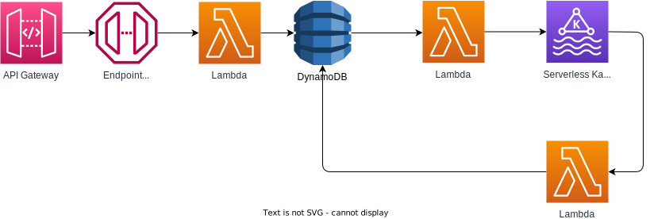

# Welcome to the Workshop - Event Driven Architecture in AWS

Welcome to united Raffle company incorporated. You are the selected group of developer that have a big challenge ahead! Tomorrow the big Raffle take place. It will be used to enable the audience of the season finale of the big tv-show "Good zombies, Sad zombies" (short GZSZ) to join a big raffle to win a brand new Mercedes.
Now since the big employee layoff in january we unfortunately let all our cloud develop go and you are our new hires. So you have to build this raffle system in one day! Otherwise we will fire you right away!
We think thousands of people will participate in the raffle and it would be catastrophic if we loose any participating customer!
On top of that all the customer data also need to be stored in a database in the old legacy system which uses Kafka as a backpressure mechanism to make sure the on-prem data center isn't exploding once the raffle is live.

Luckily for you, our chief lead architect Sven Serverless is still around and already draw some boxes and lines on the office walls which he thinks is the best and only architecture to build such a system.
Since he is best friend with the CEO, you absolutely have to build the system like he designed it, or you are fired immediately.

## Quests

- [Quest 0 - Setup](./docs/00-Setup.md)
- [Quest 1 - Lambda function](./docs/01-Lambda.md)
- [Quest 2 - ApiGateway](./docs/02-Apigateway.md)
- [Quest 3 - DynamoDB](./docs/03-DynamoDB.md)
- [Quest 4 - DynamoDB stream](./docs/04-DynamoDB_streams.md)
- [Quest 5 - Kafka producer](./docs/05-Kafka_producer.md)
- [Quest 6 - Kafka consumer](./docs/06-Kafka_consumer.md)
- [Quest 6 - DynamoDB update](./docs/07-DynamoDB_update.md)
## Architecture

In this workshop, you will learn how to build a serverless architecture using AWS services such as AWS Lambda, Amazon API Gateway, Amazon S3, Amazon DynamoDB, Amazon Kafka, and AWS CDK. 
You will learn how to write and deploy Lambda functions using Node.js 18.x, how to use the AWS CDK to define the infrastructure in code, and how to integrate different AWS services together.

You will start by building a simple Lambda function that returns a JSON object, then you will extend the architecture by adding an API Gateway to invoke the Lambda function. 
After that, you will learn how to use Amazon DynamoDB to store data and how to trigger a Lambda function using a DynamoDB stream.

Next, you will integrate Amazon Kafka with the architecture to publish events from the DynamoDB stream to a Kafka topic. 
Then, you will consume the Kafka topic using a Lambda function to determine if participants in a raffle are winners or losers.

Finally, you will store the results in DynamoDB using the same Kafka consumer Lambda function, completing the serverless architecture. 
Throughout the workshop, you will learn about the different AWS services, their use cases, and how to integrate them into a larger architecture.
