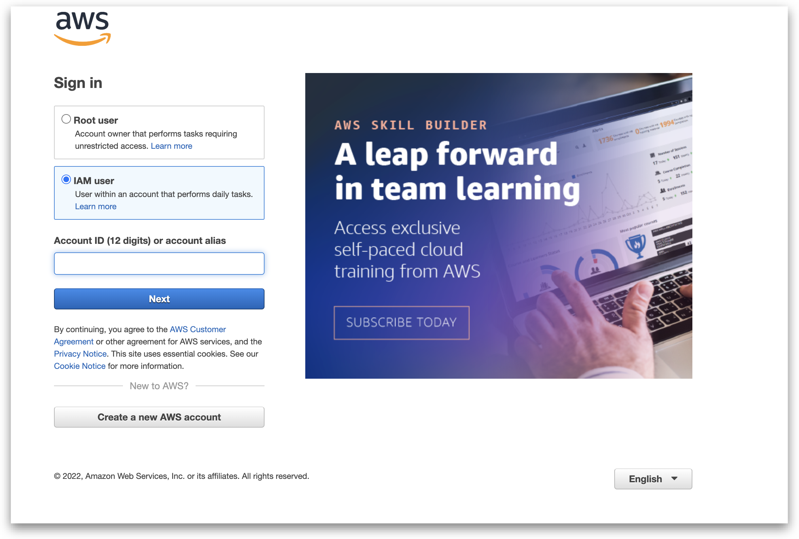

# Chapter - 0 - Setup

## Requirements

1. Install the AWS CLI
   - [AWS CLI installation](https://docs.aws.amazon.com/cli/latest/userguide/install-cliv2.html)
1. Install NodeJS >= 16
   - [NodeJS installation](https://nodejs.org/en/download/)
   - (alternative) [Node Version Manager (nvm)](https://github.com/nvm-sh/nvm)
1. IDE with Typescript support
   - VSCode is recommended

## Repository

1. Clone this repository
1. Open the folder in your IDE
1. Run `npm install` to install the dependencies
1. inspect the folder structure
   - `bin` folder contains the entry point for the CDK App
   - `lib` folder contains the code for the stack, lambda handlers and custom constructs
     - **Note**: an alternative folder structure is possible, but this is the default
   - `test` folder contains the unit tests for the stack
     - **Note**: the unit tests are not part of the workshop, but are included for completeness

## AWS setup

1. Login into the AWS console with the provided username and password
   
1. Open the system manager
   
1. Open the parameter store
   
1. Get the aws iam credentials
   
1. Configure the AWS CLI with the credentials
   ```bash
    aws configure --profile workshop --region eu-central-1
   ```
1. export the AWS profile name and region (this has to be done in every terminal session)

   ```bash
   export AWS_PROFILE=workshop
   export AWS_REGION=eu-central-1

   ```

1. Test the AWS CLI setup
   ```bash
   aws sts get-caller-identity
   ```
   This command should return the username of the IAM user you are logged in with

## CDK setup

0. Make sure you have the ENV variable `AWS_PROFILE` set to the profile name you used in the previous step
1. Bootstrap the CDK environment
   ```bash
   npm run cdk bootstrap
   ```
   - This command will setup the CDK environment in your AWS account e.g. create the S3 bucket for the deployment artifacts
1. Deploy the stack
   ```bash
   npm run cdk deploy
   ```

## (optional) IDE setup

There are several IDE extensions available to make the development easier e.g. invoke a lambda function. One of the following extensions are recommended:

- [AWS Toolkit for Visual Studio Code](https://docs.aws.amazon.com/toolkit-for-vscode/latest/userguide/setup-toolkit.html)
- [AWS Toolkit for JetBrains](https://docs.aws.amazon.com/toolkit-for-jetbrains/latest/userguide/setup-toolkit.html)
