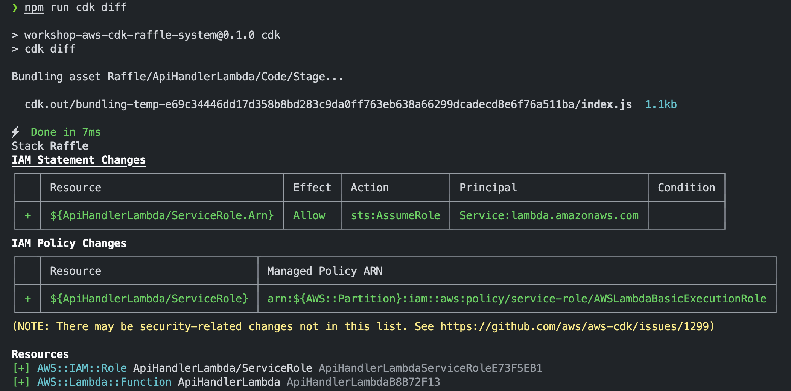
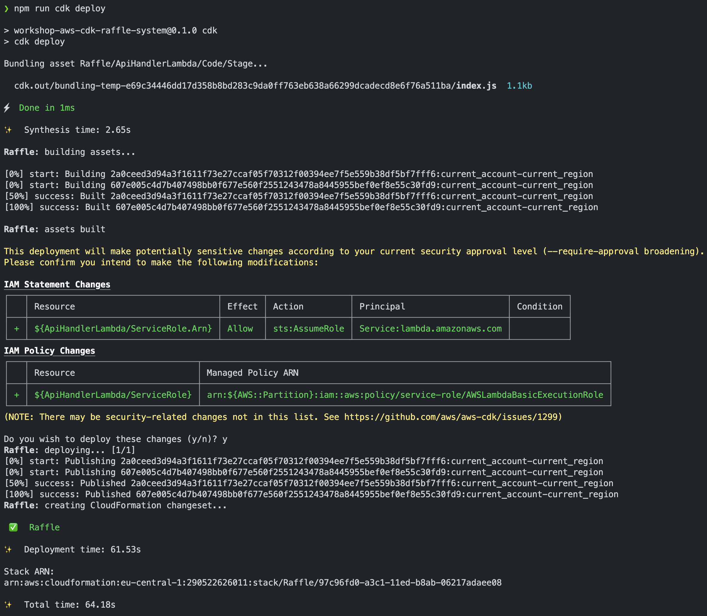

# Chapter - 1 - Lambda

AWS Lambda is a serverless compute service that allows you to run your code without provisioning or managing servers. 
With Lambda, you can build and deploy scalable applications and services in response to events or direct invocations.


In this quest, you will create a Lambda function using NodeJS 18.x runtime to kick off the development of the raffle system. 
Following Sven Serverless's guidance, and ensure that the Lambda function returns a JSON object with the structure:

```json
{
  "message": "Hello World"
}
```
Once you've crafted the Lambda function, inspect the diff of the stack, deploy it, and invoke the Lambda function to test its functionality. 
This initial Lambda function will serve as the building block for handling the massive audience expected to participate in the raffle. 
Stay focused and remember the stakes are high!

## Prerequisites

1. add the esbuild dependency to the project

   ```bash
   npm install --save-dev esbuild
   ```

   - esbuild is a bundler for javascript and typescript and is used in the CDK to bundle the Lambda function code. If the dependency is not installed, the CDK will use a docker container to bundle the code, which is slower and requires docker to be installed

## Quest

1. Create a Lambda function with NodeJS 18.x runtime in the `lib/lambda` folder of the project

   - name the file for the handler `api-handler.ts`

1. Modify the Lambda function so that it returns a JSON object with the following structure

   ```json
   {
     "message": "Hello World"
   }
   ```

1. inspect the diff of the stack

1. deploy the stack

1. Invoke the Lambda function

   - choose one of the following options
     - use the AWS CLI to invoke the Lambda function
     - use the AWS console to invoke the Lambda function
     - AWS extension of your IDE

## Hints

- [AWS Lambda NodeJS Construct](https://docs.aws.amazon.com/cdk/api/v2/docs/aws-cdk-lib.aws_lambda_nodejs-readme.html)
- [AWS documentation on Lambda with typescript](https://docs.aws.amazon.com/lambda/latest/dg/typescript-handler.html)
  - Name of the handler function should be `handler`, because the default value for the handler name in the CDK construct is `handler`
  - The handler function must be exported
- [AWS CDK cli commands](https://docs.aws.amazon.com/cdk/v2/guide/cli.html)
- [Invoke a Lambda function in AWS console(UI)](hhttps://docs.aws.amazon.com/lambda/latest/dg/testing-functions.html)

## Solution

<details>
<summary>show solution</summary>

1. create a folder called `lambda` in the `lib` folder of the project
   - these folder will contain all handler code of all the Lambda functions we will use in the project
1. create a file called `api-handler.ts` in the `lambda` folder
   - this is the handler code for the Lambda function
1. open the `lib/lambda/api-handler.ts` file and add the following code

   ```typescript
   // the exported handler function that is invoked on every request
   export const handler = async () => {
     return {
       message: "Hello World",
     };
   };
   ```

1. Add the Lambda function with NodeJS 18.x runtime to the stack in the `lib/stack.ts` file

   ```typescript
   const lambda = new NodejsFunction(this, "ApiHandlerLambda", {
     runtime: Runtime.NODEJS_18_X,
     entry: "lib/lambda/api-handler.ts",
   });
   ```

1. see the diff of the stack

   ```bash
    npm run cdk diff
   ```

   

1. deploy the stack

   ```bash
    npm run cdk deploy
   ```

   

1. Invoke the Lambda function

   - list function names

     ```bash
      aws lambda list-functions --query 'Functions[].FunctionName'
     ```

   - use the AWS CLI to invoke the Lambda function

     ```bash
     aws lambda invoke --function-name <name of the lambda function> --log-type Tail /dev/stdout
     ```

</details>
