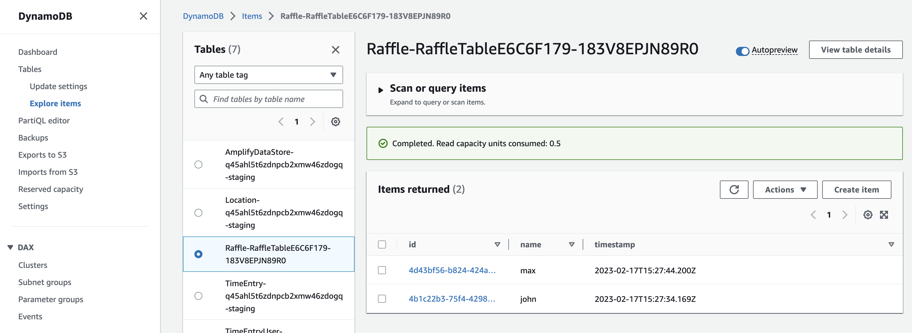

# Chapter 3 - DynamoDB

Amazon DynamoDB is a fully managed NoSQL database service that provides fast and predictable performance with seamless scalability. 
It allows you to store and retrieve any amount of data, serving any level of request traffic. In this quest, you'll be integrating DynamoDB into your raffle system to store participant information.

In this quest, you will first enhance your API to accept a `name` parameter as a query parameter, such as `<apiUrl>/raffle?name=John`. 
This parameter will be used to store the participant's name in the DynamoDB table.

Next, you'll configure your Lambda function to store both the participant's name and the current timestamp in the DynamoDB table. 
You will use a universally unique identifier (UUID) as the partition key to ensure uniqueness and efficient data retrieval.

Once you have successfully stored the participant's data in the DynamoDB table, modify your Lambda function to return the stored object in the response body, following this structure:

```json
{
  "id": "de1c73c5-2425-4aed-b3a8-54bb3cf033a0",
  "name": "John",
  "timestamp": "2023-02-17T14:36:10+00:00"
}
```

Finally, verify that the object is indeed stored in the DynamoDB table, ensuring that your implementation is functioning correctly.

Incorporating DynamoDB into your architecture will help you efficiently manage raffle participant data, ensuring a smooth and successful event. 
As you progress through this quest, remember that Sven Serverless is watching your work closely. While he may be a demanding architect, he is also proud of how far you've come in building the raffle system. Keep up the good work and continue to demonstrate your skills to secure your position on the team and earn Sven's respect.

## Prerequisites

- Add aws sdk dynamodb client v3
  ```bash
  npm install @aws-sdk/client-dynamodb @aws-sdk/util-dynamodb
  ```
  This packages are the sdk for the dynamodb service. The `@aws-sdk/client-dynamodb` package contains the client for the dynamodb service. The `@aws-sdk/util-dynamodb` package contains helper functions to convert between javascript objects and dynamodb attribute values.

## Quest

- accept a `name` parameter as query parameter

  `<apiUrl>/raffle?name=John`

- store the name and current timestamp in the dynamodb table
- use a 'uuid' as partition key
- return the stored object in the response body
  ```json
  {
    "id": "de1c73c5-2425-4aed-b3a8-54bb3cf033a0",
    "name": "John",
    "timestamp": "2023-02-17T14:36:10+00:00"
  }
  ```
- verify that the object is stored in the dynamodb table

## Hints

- [AWS DynamoDB Construct](https://docs.aws.amazon.com/cdk/api/v2/docs/aws-cdk-lib.aws_dynamodb-readme.html)
- [AWS DynamoDB Put Operation](https://docs.aws.amazon.com/sdk-for-javascript/v3/developer-guide/dynamodb-example-table-read-write.html)

  The marshall helper function helps to convert a javascript object to a dynamodb attribute value map.

  ```typescript
  const params: PutItemInput = {
    TableName: process.env.TABLE_NAME!,
    Item: marshall({
      id,
      name,
      timestamp,
    }),
  };
  ```

- The query parameter is available in the `event` object of the lambda function handler
  ```typescript
  export const handler = async (
    event: APIGatewayProxyEvent
  ): Promise<APIGatewayProxyResult> => {
    // event.queryStringParameters;
  };
  ```
- You can pass the table name into the lambda function via a `TABLE_NAME` environment variable
  - [table name attribute](https://docs.aws.amazon.com/cdk/api/v2/docs/aws-cdk-lib.aws_dynamodb.Table.html#tablename-1)
  - [set environment variables in lambda](https://docs.aws.amazon.com/cdk/api/v2/docs/aws-cdk-lib.aws_lambda.FunctionProps.html#environment)
- make sure the lambda has write access to the dynamodb table
  - [grant write access to lambda](https://docs.aws.amazon.com/cdk/api/v2/docs/aws-cdk-lib.aws_dynamodb.Table.html#grantwbrwritewbrdatagrantee)

## Solution

<details>
<summary>show solution</summary>

1.  Add DynamoDB table to stack

    ```typescript
    const table = new Table(this, "RaffleTable", {
      partitionKey: {
        name: "id",
        type: AttributeType.STRING,
      },
    });
    ```

2.  Add environment variable to lambda function

    ```typescript
    const lambda = new NodejsFunction(this, "ApiHandlerLambda", {
      runtime: Runtime.NODEJS_18_X,
      entry: "lib/lambda/api-handler.ts",
      // begin change
      environment: {
        TABLE_NAME: table.tableName,
      },
      // end change
    });
    ```

3.  Grant write access to lambda function

    ```typescript
    table.grantWriteData(lambda);
    ```

4.  Refactor lambda function to store the name and current timestamp in the dynamodb table

    ```typescript
    export const handler = async (
      event: APIGatewayProxyEvent
    ): Promise<APIGatewayProxyResult> => {
      const dynamodb = new DynamoDBClient({});
      const name = event.queryStringParameters?.name;
      const id = randomUUID();
      const timestamp = new Date().toISOString();
      const params: PutItemInput = {
        TableName: process.env.TABLE_NAME!,
        Item: marshall({
          id,
          name,
          timestamp,
        }),
      };
      const putItemCommand = new PutItemCommand(params);
      await dynamodb.send(putItemCommand);
      return {
        statusCode: 200,
        body: JSON.stringify({
          id,
          name,
          timestamp,
        }),
      };
    };
    ```

    The handler extracts the name from the query parameter. It generates a random uuid and the current timestamp. It creates a `PutItemInput` object with the table name and the item to store.
    The `marshall` function converts a javascript object to a dynamodb attribute value. The `PutItemCommand` is the command to put an item into the dynamodb table. The `send` function executes the command and stores the item in the dynamodb.

5.  Open the dynamodb table in the AWS console and verify that the item is stored in the table.

    - open AWS console
    - Navigate to DynamoDB
    - Open the Tables section

      - Explore items
      - Select the table

    

</details>
